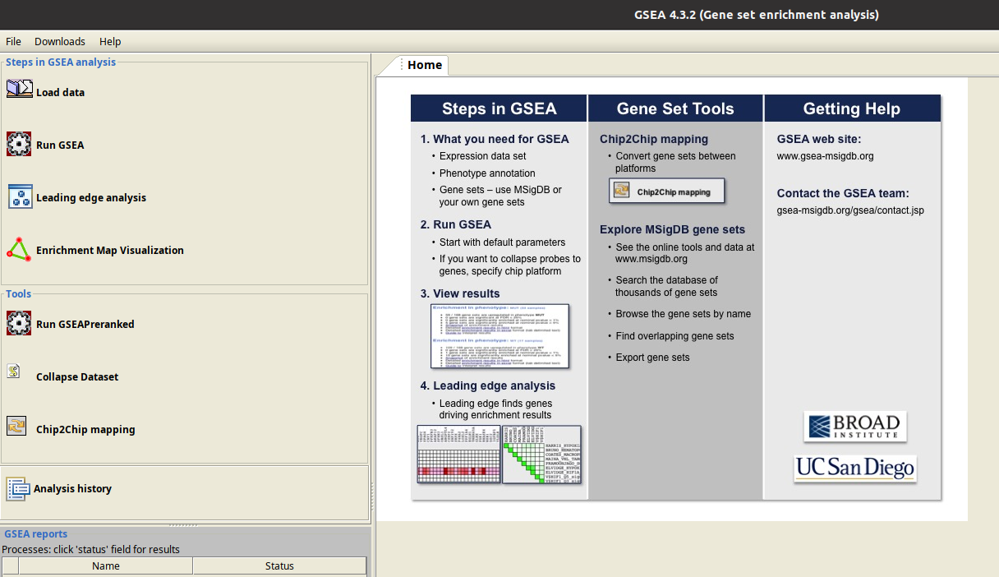

# Hands-on session Gene Set Enrichment Analysis

1️⃣ Install conda environment:
```bash
conda env create -f GSEA.yml
```
2️⃣ Activate and check hands-on session environment:
```bash
conda activate GSEA
conda list
```
3️⃣ Open GSEA software:
```bash
gsea
```
4️⃣ Perform analysis on the GSEA interface


